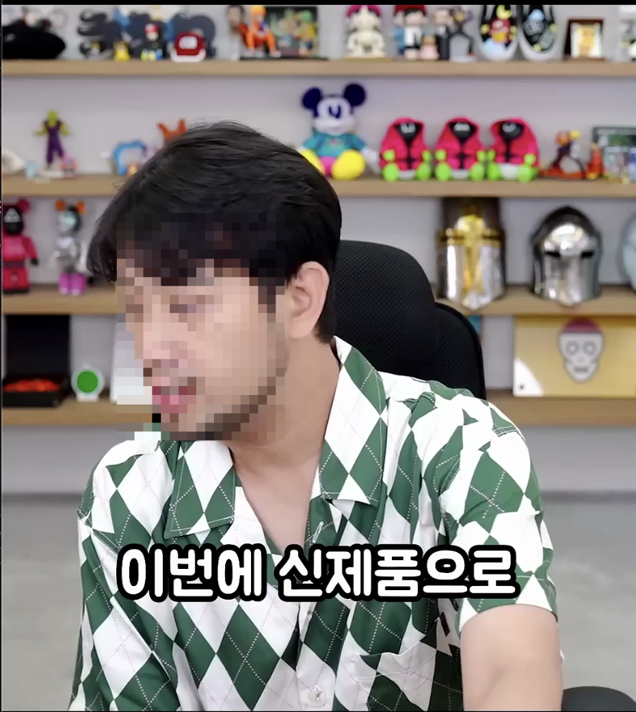

# Blur_Person_Faces: 실시간 영상 인물 얼굴 모자이크 프로젝트

## 🌟 주요 기능

* **실시간 사람 탐지:** Detectron2의 `RetinaNet` 모델을 사용하여 동영상 속 사람의 위치를 정확히 찾아냅니다.
* **2단계 얼굴 검출:** 검출된 사람 영역 내에서 **OpenCV의 DNN 얼굴 검출기(Caffe 기반)**를 사용하여 얼굴 위치를 2차로 정밀하게 찾아냅니다. 이는 다양한 각도와 조명에서도 안정적인 성능을 보입니다.
* **자동 모자이크 처리:** 검출된 얼굴 영역에만 자동으로 모자이크 효과를 적용하여 영상 속 인물의 사생활을 보호합니다.

## 🔧 시스템 구조

이 프로젝트는 다음과 같은 2단계 탐지 파이프라인으로 구성되어 있습니다.

`동영상 프레임 입력` → `1단계: 사람 탐지 (Detectron2)` → `사람 ROI 추출` → `2단계: 얼굴 탐지 (OpenCV DNN)` → `얼굴 영역 모자이크 처리` → `최종 영상 출력`

## 💻 개발 환경 및 설치 방법

이 프로젝트는 macOS (Apple Silicon) 환경에서 Conda 가상 환경을 기준으로 개발되었습니다.

### 1. 프로젝트 폴더 준비
이 README 파일이 있는 `Blur_Person_faces` 폴더를 기준으로 합니다.

### 2. Conda 가상 환경 생성 및 활성화
```bash
# 'blur_env'라는 이름의 python 3.9 가상 환경 생성
conda create -n blur_env python=3.9

# 생성한 가상 환경 활성화
conda activate blur_env
````

### 3\. 필수 라이브러리 설치

`blur_env` 가상 환경이 활성화된 터미널에서 아래 명령어들을 순서대로 실행해주세요.

```bash
# PyTorch 설치 (컴퓨터 비전의 핵심 딥러닝 라이브러리)
pip install torch torchvision torchaudio

# Detectron2 의존성 패키지 설치
pip install "git+[https://github.com/facebookresearch/fvcore.git](https://github.com/facebookresearch/fvcore.git)"
pip install Cython
pip install "git+[https://github.com/cocodataset/cocoapi.git#subdirectory=PythonAPI](https://github.com/cocodataset/cocoapi.git#subdirectory=PythonAPI)"

# OpenCV 설치 (이미지 및 비디오 처리를 위한 라이브러리)
pip install opencv-contrib-python
```

### 4\. Detectron2 설치

```bash
# Blur_Person_faces 폴더 안에 Detectron2 소스 코드를 다운로드합니다.
git clone [https://github.com/facebookresearch/detectron2.git](https://github.com/facebookresearch/detectron2.git)

# 다운로드 받은 폴더로 이동합니다.
cd detectron2

# Detectron2를 설치합니다.
pip install -e .

# 다시 원래 프로젝트 폴더로 돌아옵니다.
cd ..
```

### 5\. 모델 파일 준비

이 프로젝트는 2개의 딥러닝 모델을 사용합니다.

  * **사람 탐지 모델 (RetinaNet):** 코드를 처음 실행할 때 인터넷에서 자동으로 다운로드 됩니다.

  * **얼굴 탐지 모델 (OpenCV DNN):** 아래 두 개의 파일을 **직접 다운로드** 받아서, `Blur_Person_faces` 폴더 안에 **`models`** 라는 새 폴더를 만들고 그 안에 넣어주세요.

    1.  **`deploy.prototxt.txt` (모델 구조 파일):**
          * [다운로드 링크](https://www.google.com/search?q=https://github.com/opencv/opencv/raw/master/samples/dnn/face_detector/deploy.prototxt.txt)
    2.  **`res10_300x300_ssd_iter_140000.caffemodel` (학습된 가중치 파일):**
          * [다운로드 링크](https://github.com/opencv/opencv_3rdparty/raw/dnn_samples_face_detector_20180220_uint8/res10_300x300_ssd_iter_140000.caffemodel)

## ▶️ 실행 방법

1.  프로젝트의 메인 파이썬 스크립트 (예: `mosaic_project.py`)를 텍스트 에디터로 엽니다.
2.  코드 맨 아래 `if __name__ == '__main__':` 블록 안에 있는 **사용자 설정 영역**의 경로 변수들을 자신의 환경에 맞게 수정합니다.
    ```python
    # 프로젝트 폴더의 전체 경로
    PROJECT_ROOT_PATH = "프로젝트 폴더의 경로"

    # 처리할 동영상 파일 이름
    VIDEO_FILENAME = "sample_video.mp4"

    # 위 두 변수를 기반으로 나머지 경로들이 자동으로 설정됩니다.
    ```
3.  `blur_env` 가상 환경이 활성화된 터미널에서 `python mosaic_project.py` 명령어로 스크립트를 실행하세요.
4.  실행되면, 동영상 속 사람들의 얼굴에 모자이크가 적용된 창이 나타납니다. 종료하려면 `q` 키를 누르세요.

## ▶️ 실행 예시

